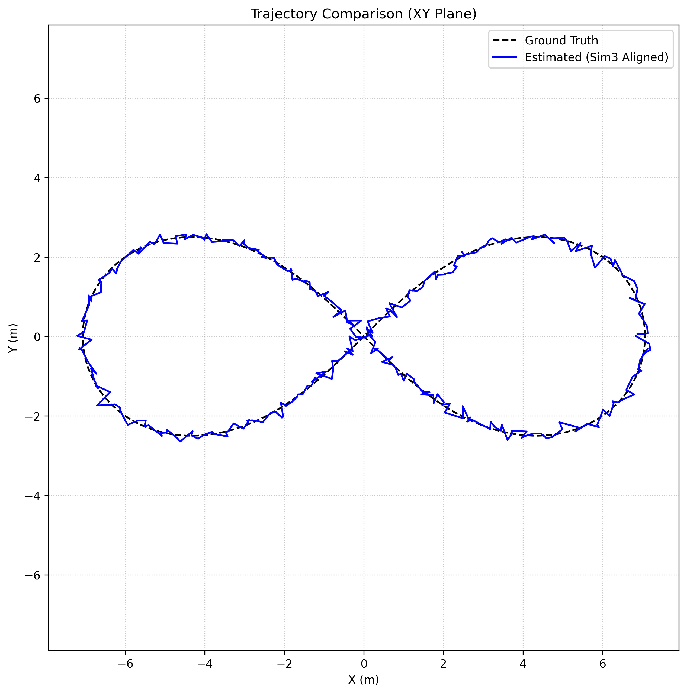
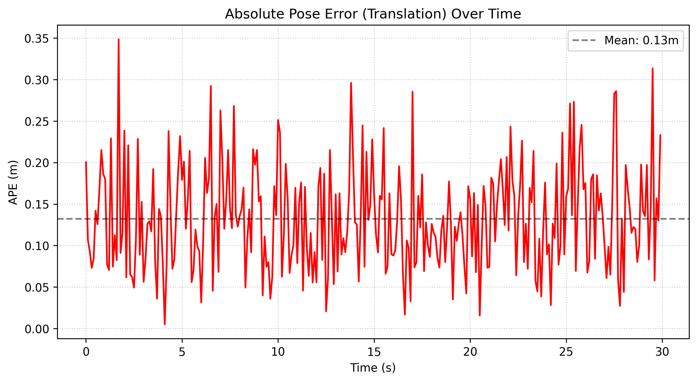

# SLAM Evaluation Report

| Field | Value |
|---|---|
| Dataset | `test_bag_dataset` |
| SLAM Mode | `mono` |
| Run Date | 20260616_145527 |

## Summary

| Metric | Value |
|---|---|
| **APE RMSE** | **0.1460 m** |
| APE mean | 0.1322 m |
| APE std | 0.0621 m |
| APE max | 0.3485 m |
| **RPE RMSE (Δ=1 frame)** | **0.2092 m** |
| GT trajectory length | 37.08 m |
| Estimated poses | 300 |
| Associated poses | 300 |
| **Drift (APE RMSE / traj length)** | **0.39 %** |

## Absolute Pose Error (APE — translation)

| Stat | Value (m) |
|---|---|
| rmse | 0.1460 |
| mean | 0.1322 |
| std | 0.0621 |
| min | 0.0050 |
| max | 0.3485 |
| sse | 6.3964 |
| n_poses | 300 |

## Relative Pose Error (RPE — translation)

### Δ=1 frame (frame-to-frame drift)

| Stat | Value (m) |
|---|---|
| rmse | 0.2092 |
| mean | 0.1904 |
| std | 0.0867 |
| max | 0.4893 |

### Δ=100 frames (medium-range drift)

| Stat | Value (m) |
|---|---|
| rmse | 0.3212 |
| mean | 0.3097 |
| std | 0.0849 |
| max | 0.3946 |

## Trajectory Alignment (Sim3)

The estimated trajectory was aligned to the ground truth using Umeyama Sim3 alignment:

- **Scale ($s$)**: `0.999434`

**Rotation Matrix ($R$)**:
```text
[  1.00000,   0.00210,  -0.00002]
[ -0.00210,   1.00000,  -0.00074]
[  0.00001,   0.00074,   1.00000]
```

**Translation Vector ($t$)**:
```text
[  0.00287,  -0.00376,  -0.00261]^T
```

## System Behaviour (from logs)

| Event | Count |
|---|---|
| Keyframes added | 0 |
| Graph edges (est.) | 0 |
| **Local BA ran** | **0** |
| Local BA skipped | 0 |
| VO rejects (total) | 0 |
| Tracking LOST events | 0 |
| Tracking WEAK events | 0 |
| Tracking recoveries | 0 |
| Loop closures | 0 |
| VINS scale failures | 0 |

### VINS Initialization

- Status: **Not reached**

## Warnings (0 total)


## Errors (1 total)

- `[ERROR] [gps_visualizer_node.py-4]: process has died [pid 81263, exit code 1, cmd '/home/tarun/Desktop/new_websit/slam_ws/install/visual_graph_slam/lib/visual_graph_slam/gps_visualizer_node.py --ros-args -r __node:=gps_visualizer_node'].` (x1)

## Raw Results (JSON)

```json
{
  "dataset": "test_bag_dataset",
  "slam_mode": "mono",
  "ape_rmse_m": 0.14601776811830372,
  "rpe1_rmse_m": 0.2091995347587653,
  "traj_length_m": 37.07906727265899,
  "keyframes": 0,
  "vo_rejects_total": 0,
  "tracking_lost": 0,
  "loop_closures": 0
}
```

## Visualizations




